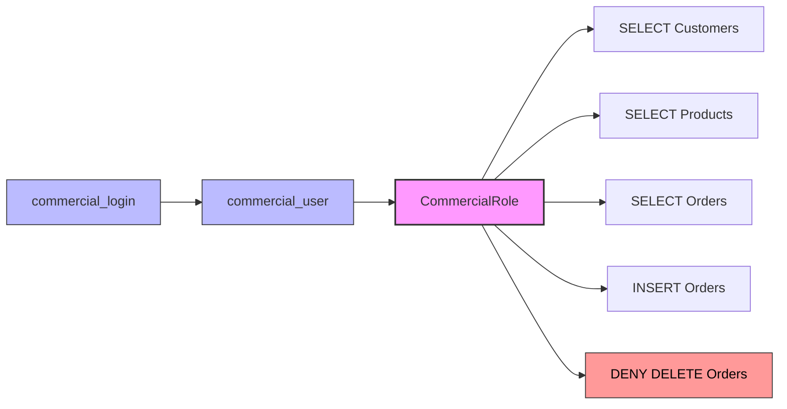

## Objectifs

> [!info] Objectif Gestion des logins, utilisateurs, rôles et permissions dans SQL Server.
> 
> Microsoft SQL Server met à disposition plusieurs mécanismes permettant de contrôler l'accès aux ressources. Parmi ces mécanismes figurent les logins, les utilisateurs, les rôles et les permissions.

## Les Logins (Authentication)

### Contexte

Un login représente une identité autorisée à se connecter à l'instance SQL Server.

Avant d'accéder à une base de données, un utilisateur doit d'abord être authentifié par le serveur SQL Server grâce à un login.

> [!warning] À retenir Sans login, aucune connexion à SQL Server n'est possible.

### Création d'un login

Nous avons créé un login destiné à un employé du service commercial.

```sql
CREATE LOGIN commercial_login
WITH PASSWORD = 'Commerciallogin667$';
```

Cette commande crée un compte capable de se connecter au serveur SQL Server.

> [!note] Remarque Cependant, ce login ne possède encore aucun accès à la base de données ShopDB.

## Les Utilisateurs (Authorization)

### Contexte

Un utilisateur (_User_) représente l'identité du login à l'intérieur d'une base de données spécifique.

Une fois connecté au serveur grâce à son login, l'utilisateur doit disposer d'un compte dans la base de données qu'il souhaite utiliser.

> [!tip] Analogie On peut comparer cela à un employé possédant une clé d'entrée dans un bâtiment mais ayant besoin d'une autorisation supplémentaire pour accéder à certains bureaux.

### Création d'un utilisateur

Après la création du login, nous avons créé un utilisateur dans la base ShopDB.

```sql
USE ShopDB;

CREATE USER commercial_user
FOR LOGIN commercial_login;
```

Le login peut désormais être reconnu à l'intérieur de la base ShopDB.

> [!note] Remarque À ce stade, l'utilisateur existe dans la base mais ne possède toujours aucune permission particulière.

## Les Rôles

### Contexte

Les rôles permettent de regrouper plusieurs utilisateurs partageant les mêmes responsabilités.

Au lieu d'accorder individuellement des permissions à chaque utilisateur, il est plus simple de créer un rôle puis d'y ajouter les utilisateurs concernés.

> [!tip] Bonne pratique Cette approche simplifie grandement l'administration et la maintenance de la sécurité.

### Rôles prédéfinis

SQL Server fournit plusieurs rôles par défaut. Parmi les plus utilisés :

**`db_datareader`** — Permet de consulter les données de toutes les tables.

```sql
ALTER ROLE db_datareader
ADD MEMBER commercial_user;
```

L'utilisateur peut alors exécuter :

```sql
SELECT * FROM Customers;
SELECT * FROM Products;
SELECT * FROM Orders;
```

**`db_datawriter`** — Permet d'ajouter, modifier ou supprimer des données.

```sql
ALTER ROLE db_datawriter
ADD MEMBER commercial_user;
```

L'utilisateur peut désormais utiliser :

```sql
INSERT
UPDATE
DELETE
```

sur les tables de la base.

**`db_owner`** — Accorde un contrôle total sur la base de données.

```sql
ALTER ROLE db_owner
ADD MEMBER admin_user;
```

> [!danger] Attention Ce rôle est généralement réservé aux administrateurs de bases de données. Il ne doit pas être attribué à un utilisateur métier (ex. `commercial_user`).

### Création d'un rôle personnalisé

Nous avons créé un rôle destiné aux employés du service commercial.

```sql
CREATE ROLE CommercialRole;
```

Puis nous avons ajouté l'utilisateur au rôle :

```sql
ALTER ROLE CommercialRole
ADD MEMBER commercial_user;
```

## Les Permissions

### Contexte

Les permissions définissent les actions qu'un utilisateur ou un rôle peut effectuer sur les objets de la base de données.

Les principales permissions sont :

|Permission|Description|
|---|---|
|SELECT|Lire les données|
|INSERT|Ajouter des données|
|UPDATE|Modifier des données|
|DELETE|Supprimer des données|
|EXECUTE|Exécuter une procédure stockée|

### Attribution des permissions

Dans notre exemple, les employés commerciaux doivent pouvoir consulter les clients et enregistrer de nouvelles commandes.

Nous avons accordé les permissions suivantes :

```sql
GRANT SELECT
ON dbo.Customers
TO CommercialRole;
```

```sql
GRANT SELECT
ON dbo.Products
TO CommercialRole;
```

```sql
GRANT SELECT
ON dbo.Orders
TO CommercialRole;
```

```sql
GRANT INSERT
ON dbo.Orders
TO CommercialRole;
```

> [!tip] Astuce Pour attribuer le droit de lecture sur tout le schéma, il suffit de faire ce qui suit :

```sql
GRANT SELECT
ON SCHEMA::dbo
TO CommercialRole;

GRANT INSERT
ON dbo.Orders
TO CommercialRole;
```

### Restriction des permissions

Les employés commerciaux ne doivent pas pouvoir supprimer les commandes.

Pour cela, nous avons interdit explicitement cette opération :

```sql
DENY DELETE
ON dbo.Orders
TO CommercialRole;
```

> [!danger] Sécurité Ainsi, toute tentative de suppression sera refusée par SQL Server.

## Cas Pratique

> [!info] Scénario mis en œuvre
> 
> 1. Création du login `commercial_login`.
> 2. Création de l'utilisateur `commercial_user`.
> 3. Création du rôle `CommercialRole`.
> 4. Ajout de l'utilisateur dans le rôle.
> 5. Attribution des permissions de consultation des clients, produits et commandes.
> 6. Autorisation d'ajouter de nouvelles commandes.
> 7. Interdiction de supprimer des commandes.

L'architecture obtenue est la suivante :



> [!success] Principe respecté Cette organisation permet de respecter le principe du moindre privilège, selon lequel chaque utilisateur ne dispose que des droits nécessaires à l'exécution de ses tâches.

## Test

- Authentification à l'aide de l'utilisateur créé :

![[Screenshot From 2026-07-05 13-24-43.png]]

- Tester les permissions
    
- Lecture
    
    ![[Screenshot From 2026-07-05 13-29-09.png]]
    
- Suppression (interdite)
    
    ![[Screenshot From 2026-07-05 13-29-40.png]]
    

## Ressources

- [Get started with Database Engine permissions](https://learn.microsoft.com/en-us/sql/relational-databases/security/authentication-access/getting-started-with-database-engine-permissions?view=sql-server-ver17) 