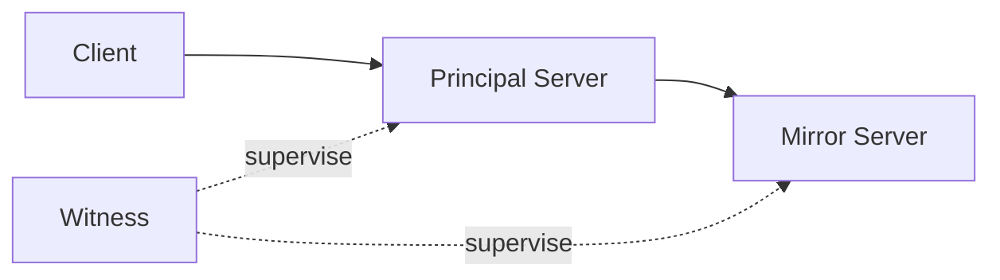
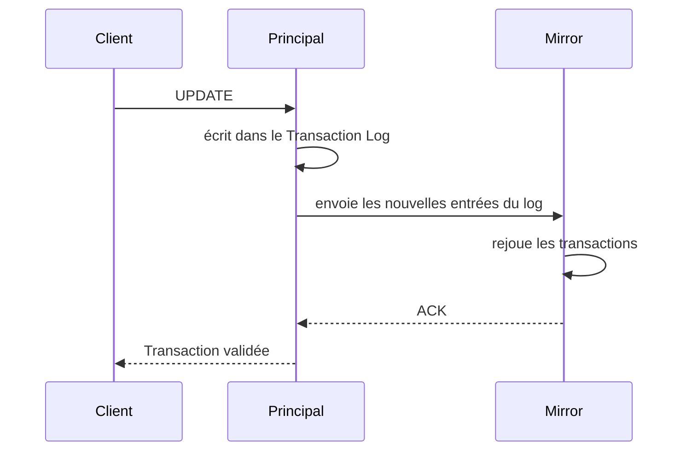
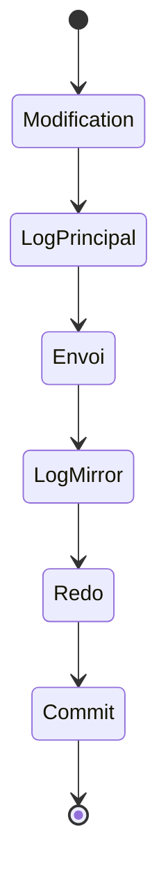
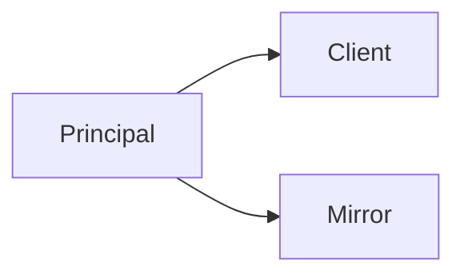
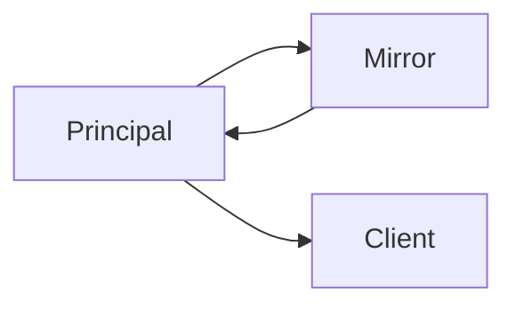

![[availability-group-introduction.png]]

## Objectifs

> [!info] Objectifs Le mirroring répond principalement à quatre problématiques :
> 
> - assurer la disponibilité des données
> - limiter les interruptions de service
> - réduire les pertes de données
> - permettre un basculement rapide vers un serveur de secours

> [!warning] Ce n'est pas une sauvegarde Il ne constitue **pas** une solution de sauvegarde, car toute erreur logique (suppression accidentelle, corruption logique, etc.) est également répliquée sur le miroir.

## Contexte

> [!info] Définition Le **Database Mirroring** est une technologie de **haute disponibilité (High Availability)** permettant de maintenir **deux copies identiques** d'une même base de données SQL Server.
> 
> L'objectif est de garantir qu'en cas de défaillance du serveur principal, une autre copie de la base puisse prendre le relais avec une perte de données minimale, voire nulle selon le mode de fonctionnement.

> [!note] Différence avec une sauvegarde Contrairement à une sauvegarde classique, le serveur miroir est maintenu **presque en temps réel** grâce à l'envoi continu des journaux de transactions.

## Architecture

Le mirroring repose sur plusieurs composants.



### Principal Server

Le serveur principal est celui utilisé par les applications.

Toutes les opérations de lecture et d'écriture sont effectuées sur cette instance. La base de données est accessible.

### Mirror Server

Le serveur miroir reçoit toutes les transactions provenant du principal.

La base reste dans l'état :

```
RESTORING
```

> [!warning] Non accessible Elle n'est donc pas accessible aux utilisateurs. Elle sert uniquement de copie de secours.

### Witness (optionnel)

Le témoin ne contient **aucune donnée**.

Son rôle est uniquement de participer à la décision de basculement automatique.

> [!danger] Split Brain Il permet d'éviter qu'un problème réseau ne conduise à deux serveurs pensant être tous les deux principaux (Split Brain).

## Fonctionnement général

Lorsqu'un utilisateur exécute une transaction :

```sql
UPDATE Produit
SET Prix = 120
WHERE Id = 5;
```

Plusieurs étapes se produisent.



> [!warning] Important Le mécanisme repose exclusivement sur le **Transaction Log**. Le principal **n'envoie jamais directement les lignes modifiées** ; il transmet uniquement les enregistrements du journal des transactions. Le miroir exécute ensuite exactement les mêmes opérations.

## États d'une transaction

Une transaction passe par plusieurs étapes.



## Modes de fonctionnement

Le mirroring possède deux modes principaux.

### 1. High Performance (Asynchrone)



Le principal valide immédiatement la transaction. Le miroir reçoit les données plus tard.

**Avantages**

- performances élevées
- faible latence

**Inconvénients**

> [!danger] Risque Si le principal tombe en panne avant l'arrivée des derniers logs, certaines transactions peuvent être perdues.

### 2. High Safety (Synchrone)



Le principal attend que le miroir confirme l'écriture.

**Avantages**

- aucune perte de données
- cohérence parfaite

**Inconvénients**

- transactions légèrement plus lentes

## Communication entre les serveurs

Les deux serveurs communiquent grâce à un **Database Mirroring Endpoint**.


Chaque endpoint écoute sur un port TCP.

Exemple :

```
5022
```

Toutes les informations du Transaction Log transitent par cette connexion.

## Authentification

Les endpoints doivent s'authentifier.

### Certificate Authentication

> [!tip] Cas d'usage Utilisée principalement sous Linux ou entre serveurs sans domaine.

Chaque serveur possède :

- une clé privée
- un certificat
- la clé publique des autres serveurs


Cette méthode garantit que les deux serveurs sont bien ceux attendus.

## Failover

Le failover consiste à inverser les rôles.

Avant :


Après :


> [!success] Résultat L'ancien miroir devient le nouveau principal. Les applications peuvent alors continuer leur travail.

## Types de Failover

### Manuel

L'administrateur déclenche lui-même le changement.

```sql
ALTER DATABASE ...
SET PARTNER FAILOVER;
```

### Automatique

> [!warning] Prérequis Nécessite :
> 
> - mode synchrone
> - présence d'un Witness (introuvable chez linux)

Le basculement est automatique.

## États possibles

|État|Description|
|---|---|
|SYNCHRONIZING|Synchronisation en cours|
|SYNCHRONIZED|Les deux bases sont identiques|
|SUSPENDED|Mirroring arrêté|
|DISCONNECTED|Communication perdue|
|PENDING FAILOVER|Basculement en attente|

## Avantages

> [!success] Avantages
> 
> - Haute disponibilité
> - Temps de reprise très faible
> - Synchronisation continue
> - Configuration relativement simple
> - Possibilité de failover automatique
> - Très faible perte de données

## Limitations

> [!danger] Limitations
> 
> - Seulement deux copies de la base
> - Une seule base par session de mirroring
> - Le miroir n'est pas utilisable en lecture (hors snapshots)
> - Nécessite le modèle de récupération FULL
> - Fonctionnalité dépréciée au profit des Always On Availability Groups dans les versions récentes de SQL Server
# Cas Pratique 

+ L'activation de HADR (High Availability Disaster Recovery) dans les deux contenaires![[Pasted image 20260717104847.png]]
+ Met la base de donnée en mode full recovery (les journeaux transactionnelles ne sont pas supprimées ssi on a un backup)

	![[Screenshot From 2026-07-17 18-26-41.png]]
+ Faire un full backup pour la base de données à repliquée 
	+ instance sqlserver principale
	![[Screenshot From 2026-07-17 19-17-21.png]]
	+ instance sqlserver secondaire 
	![[Screenshot From 2026-07-17 19-18-54.png]]
+ creation des certificats et les enregister sur un dossier commun 
	+ instance sqlserver principale
	![[Screenshot From 2026-07-17 19-21-12.png]]
	+ instance sqlserver secondaire
	![[Screenshot From 2026-07-17 19-22-28.png]]
+ le chargment des certificats dans chaque instance et la creation d'un login à partir de certificat chargée
	+ instance sqlserver principale
	 ![[Pasted image 20260717192527.png]]
	+ instance sqlserver secondaire
		![[Screenshot From 2026-07-17 19-26-58.png]]
+ création d'un listner endpoint qui va assuer la synchronisation entre les deux instances de base de données et donner l'accés au partenaire 
	+ instance sqlserver principale
		![[Pasted image 20260717193113.png]]
	+ instance sqlserver secondaire 
		![[Pasted image 20260717192949.png]]
+ choisir le mode de mirroring (on choisit le mode synchrone ici)

	![[Screenshot From 2026-07-17 19-33-11.png]]
	
+ inspection finale 
	![[Pasted image 20260717193420.png|661]]

# Ressources 

[Database Mirroring (SQL Server)](https://learn.microsoft.com/en-us/sql/database-engine/database-mirroring/database-mirroring-sql-server?view=sql-server-ver17)


