## Objectifs

> [!info] Objectif L'objectif de cette étude était de comprendre ce que signifie **gérer un index** dans une base de données et pourquoi la création d'un index ne constitue pas la fin de son cycle de vie.

Un index doit être surveillé et maintenu afin de garantir un bon équilibre entre :

- la performance des requêtes ;
- l'espace disque utilisé ;
- le coût des opérations d'insertion, de modification et de suppression ;
- la fragmentation ;
- la qualité des statistiques utilisées par l'optimiseur de requêtes.

## 1. Que signifie gérer un index ?

La gestion d'un index correspond à l'ensemble des opérations réalisées pendant son cycle de vie.

Elle comprend principalement :

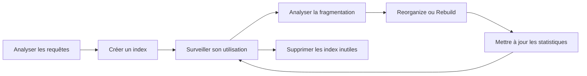

> [!note] Remarque La gestion d'un index ne consiste donc pas uniquement à exécuter `CREATE INDEX`.

## 2. Création des index

La première étape consiste à identifier les colonnes fréquemment utilisées dans les requêtes.

Les index sont généralement utiles pour les colonnes utilisées dans :

- `WHERE` ;
- `JOIN` ;
- `ORDER BY` ;
- `GROUP BY` ;
- les contraintes `PRIMARY KEY` ;
- les contraintes `UNIQUE`.

Exemple :

```sql
select *  
from ArchiveDb.dbo.Documents  
where Nom_doc = 'Document_20740.png';
```

Si cette requête est fréquemment exécutée sur une grande table, un index sur `Nom_Doc` peut améliorer les performances :

```sql
create nonclustered index IX_Documents_Nom_Doc
ON Documents (Nom_Doc);
```

## 3. Le coût des index

Un index accélère généralement les lectures, mais il ajoute un coût lors des modifications.

Lorsqu'une ligne est insérée :

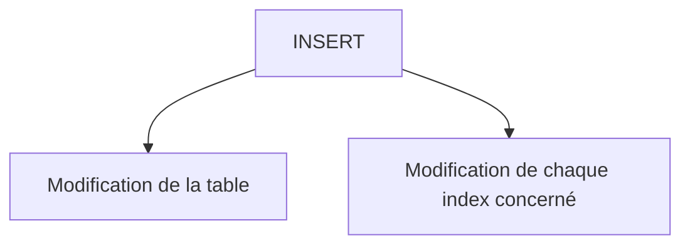

Lorsqu'une ligne est modifiée ou supprimée, les index doivent également être mis à jour.

> [!danger] Risque Ainsi, une table avec trop d'index peut présenter les problèmes suivants :

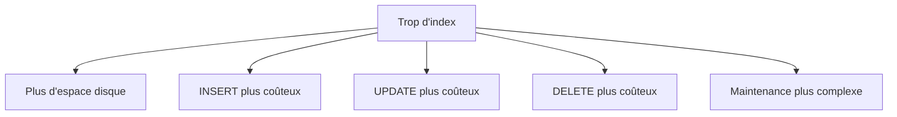

La gestion des index consiste donc à trouver un compromis entre les performances de lecture et le coût des opérations d'écriture.

## 4. Surveillance de l'utilisation des index

Un index peut exister sans jamais être utilisé.

Il est donc nécessaire d'analyser les statistiques d'utilisation afin d'identifier :

- les index fréquemment utilisés ;
- les index rarement utilisés ;
- les index jamais utilisés ;
- les index qui coûtent beaucoup lors des modifications.

Un index inutilisé peut être un candidat à la suppression.

> [!warning] Prudence Il faut être prudent avant de supprimer un index. Les statistiques d'utilisation peuvent être réinitialisées après un redémarrage du serveur SQL Server. Un index qui semble inutilisé peut donc être utilisé par une application dans une période qui n'a pas encore été observée.

+ Pour voir les statistiques concernant les indexes

```sql
SELECT  
    OBJECT_SCHEMA_NAME(i.object_id) AS SchemaName,  
    OBJECT_NAME(i.object_id) AS TableName,  
    i.name AS IndexName,  
    i.type_desc AS IndexType,  
  
    -- Reads  
    ISNULL(us.user_seeks, 0)   AS UserSeeks,  
    ISNULL(us.user_scans, 0)   AS UserScans,  
    ISNULL(us.user_lookups, 0) AS UserLookups,  
  
    -- Writes  
    ISNULL(us.user_updates, 0) AS UserUpdates,  
  
    -- Last usage  
    us.last_user_seek,  
    us.last_user_scan,  
    us.last_user_lookup,  
    us.last_user_update  
  
FROM sys.indexes AS i  
         LEFT JOIN sys.dm_db_index_usage_stats AS us  
                   ON us.object_id = i.object_id  
                       AND us.index_id = i.index_id  
                       AND us.database_id = DB_ID()
```

# 5. Fragmentation des index

## 5.1 Le principe

Un index est physiquement stocké sous forme de **pages** (généralement 8 Ko dans SQL Server), organisées en **B-Tree** (arbre équilibré). Au niveau feuille de cet arbre, les pages sont censées être liées entre elles dans l'ordre logique des clés, via une liste chaînée (chaque page pointe vers la suivante).

Tant qu'aucune modification n'intervient, l'ordre **logique** (l'ordre des clés) correspond à l'ordre **physique** (l'emplacement réel sur le disque) :

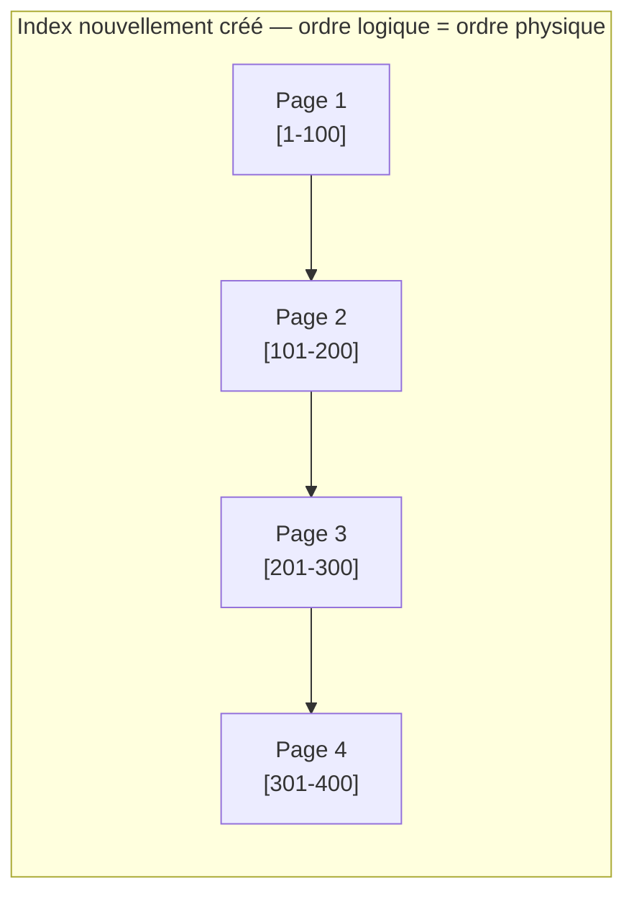

Parcourir l'index dans l'ordre revient alors à lire le disque de façon **séquentielle** — l'opération la moins coûteuse pour le moteur de stockage.

## 5.2 Comment la fragmentation apparaît

Le problème survient lors des `INSERT`, `UPDATE` et `DELETE`.

**Cas typique : le page split (division de page)**

Chaque page a une capacité limitée. Si on insère une nouvelle ligne dont la clé doit se situer _au milieu_ d'une page déjà pleine, SQL Server ne peut pas l'y ajouter. Il effectue alors un **page split** :

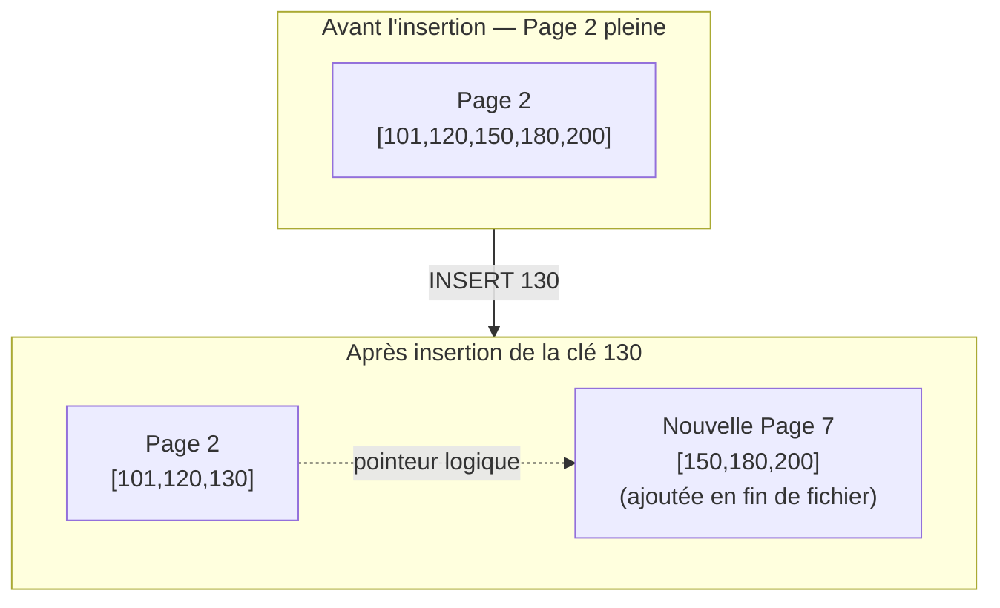

La nouvelle page (Page 7) est créée **à la fin du fichier physique**, même si logiquement elle doit être lue juste après la Page 2. Le pointeur logique est correct (la liste chaînée sait que Page 2 → Page 7 → Page 3), mais **l'emplacement physique**, lui, ne suit plus cet ordre.

Si ce phénomène se répète au fil des insertions/suppressions, on obtient :

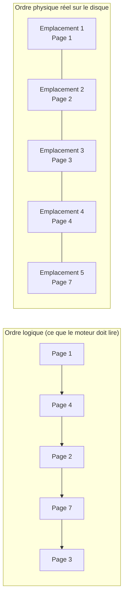

Le moteur doit suivre l'ordre logique (Page 1 → 4 → 2 → 7 → 3), mais ces pages sont dispersées physiquement (emplacements 1, 4, 2, 5, 3). Résultat : le disque doit **sauter d'un endroit à l'autre** au lieu de lire en continu.

## 5.3 Les deux types de fragmentation

| Type                                | Définition                                                                      | Effet                                                                               |
| ----------------------------------- | ------------------------------------------------------------------------------- | ----------------------------------------------------------------------------------- |
| **Fragmentation externe (logique)** | L'ordre physique des pages ne correspond plus à l'ordre logique de l'index      | Davantage de déplacements de tête de lecture / lectures non séquentielles           |
| **Fragmentation interne**           | Les pages contiennent de l'espace vide (suite à des suppressions ou des splits) | Plus de pages nécessaires pour stocker le même volume de données → plus de lectures |

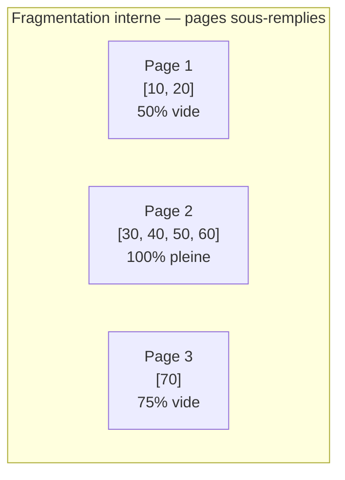

Une page à moitié vide occupe quand même un emplacement disque entier et une entrée en mémoire cache — c'est du gaspillage d'espace et d'I/O, même sans problème d'ordre.

## 5.4 Conséquence pour le moteur

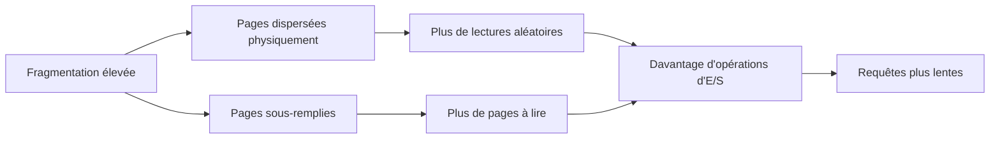

Sur un disque mécanique, l'effet est très marqué (déplacement physique de la tête de lecture). Sur un SSD, l'impact est moindre mais reste réel : plus de pages à lire signifie plus d'opérations d'E/S logiques et une pression accrue sur le cache mémoire (buffer pool).

>[!info]
>pour voir des données importantes sur la fragmentation d'un index 

```sql
SELECT OBJECT_SCHEMA_NAME(ips.object_id) AS schema_name,  
       OBJECT_NAME(ips.object_id) AS object_name,  
       i.name AS index_name,  
       i.type_desc AS index_type,  
       ips.avg_fragmentation_in_percent,  -- external fragmentation
       ips.avg_page_space_used_in_percent,  -- internal fragmentation
       ips.page_count,  
       ips.alloc_unit_type_desc  
FROM sys.dm_db_index_physical_stats(DB_ID(), default, default, default, 'SAMPLED') AS ips  
         INNER JOIN sys.indexes AS i  
                    ON ips.object_id = i.object_id  
                        AND  
                       ips.index_id = i.index_id  
ORDER BY page_count DESC;
```
# 6. REORGANIZE et REBUILD

SQL Server mesure la fragmentation via la vue `sys.dm_db_index_physical_stats`, qui renvoie notamment `avg_fragmentation_in_percent`. Selon ce taux, on choisit l'une des deux opérations de maintenance suivantes.

## 6.1 REORGANIZE

```sql
ALTER INDEX IX_Documents_Nom_Doc
ON Documents
REORGANIZE;
```

**Fonctionnement** : REORGANIZE parcourt les pages **au niveau feuille** de l'index et les réordonne physiquement pour qu'elles correspondent à l'ordre logique — un peu comme trier des cartes déjà en main, sans les redistribuer entièrement. Elle compacte aussi légèrement les pages entre elles.

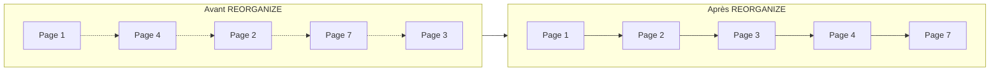

**Caractéristiques :**

- Opération **en ligne** par nature (ne verrouille pas la table de façon prolongée)
- Peut être **interrompue** à tout moment sans perte de progression (elle reprendra au point où elle s'est arrêtée)
- Moins gourmande en ressources CPU et journal des transactions
- **Ne recalcule pas les statistiques** de l'index
- Moins efficace sur une fragmentation très élevée : elle ne repart pas de zéro, donc certains gains (comme la densité de page) sont limités

**Usage recommandé** : fragmentation modérée, généralement entre **5 % et 30 %**.

## 6.2 REBUILD

```sql
ALTER INDEX IX_Documents_Nom_Doc
ON Documents
REBUILD;
```

**Fonctionnement** : REBUILD **supprime et recrée entièrement l'index** à partir des données de la table, en repartant de zéro. Les nouvelles pages sont allouées de façon contiguë et remplies selon le facteur de remplissage (`FILLFACTOR`) défini.

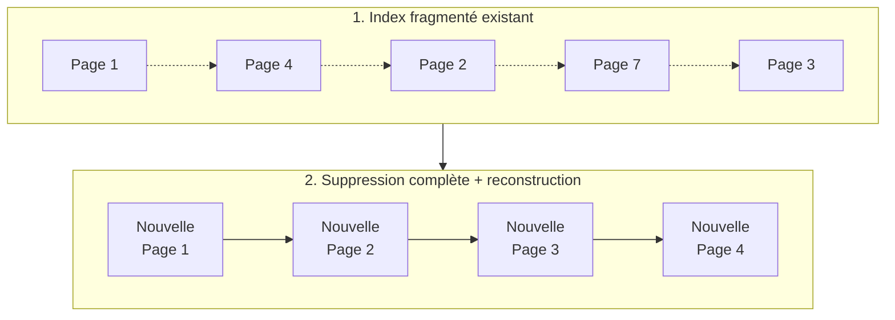

**Caractéristiques :**

- Reconstruction complète → fragmentation ramenée à (quasiment) 0 %
- **Recalcule automatiquement les statistiques** de l'index avec un échantillonnage complet (avantage non négligeable pour l'optimiseur de requêtes)
- Peut s'exécuter **`ONLINE`** (Enterprise Edition principalement) : `REBUILD WITH (ONLINE = ON)`, ce qui limite les verrous
- Beaucoup plus coûteuse en CPU, en I/O et en journal des transactions, surtout sur de grandes tables
- Nécessite un espace disque supplémentaire temporaire (l'ancien et le nouvel index coexistent pendant l'opération)

**Usage recommandé** : fragmentation élevée, généralement **> 30 %**.

## 6.3 Tableau de décision

|Taux de fragmentation|Action recommandée|Justification|
|---|---|---|
|< 5-10 %|Aucune action|Impact négligeable sur les performances|
|10 % – 30 %|`REORGANIZE`|Correction suffisante, coût faible, opération en ligne|
|> 30 %|`REBUILD`|Correction complète nécessaire, gain de performance et mise à jour des statistiques|

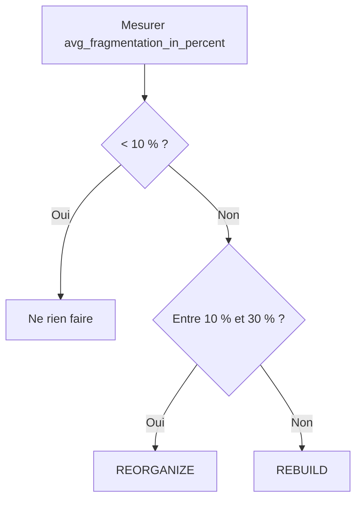

**Remarque pratique** : ces seuils (10 %, 30 %) sont ceux historiquement recommandés par Microsoft, mais ils restent indicatifs — le contexte compte aussi : taille de la table, fréquence des requêtes, fenêtre de maintenance disponible, et édition de SQL Server (Standard vs Enterprise, qui affecte la disponibilité du mode `ONLINE`).
## 7. Gestion des statistiques

Les statistiques décrivent la distribution des données dans les colonnes.

L'optimiseur de requêtes utilise ces informations pour choisir un plan d'exécution.

Par exemple, il peut décider entre :

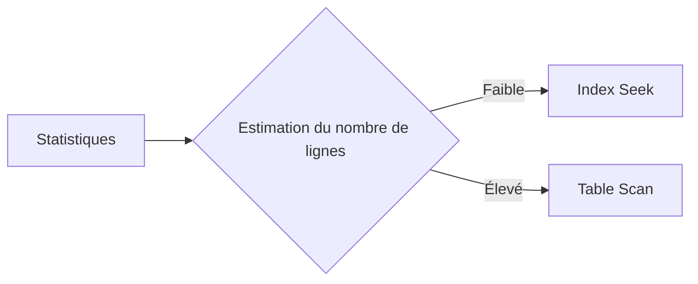

> [!danger] Risque Des statistiques obsolètes peuvent entraîner un mauvais plan d'exécution.

Il est donc important de maintenir également les statistiques :

```sql
UPDATE STATISTICS Documents;
```

> [!note] Remarque Le processus de gestion d'un index ne concerne donc pas uniquement sa structure physique. Il concerne également les informations utilisées par l'optimiseur.

## 8. Suppression des index inutiles

Un index qui n'apporte aucun bénéfice peut devenir une charge inutile.

Exemple :

```sql
DROP INDEX IX_Documents_Nom_Doc
ON Dcouments;
```

> [!warning] Avant de supprimer un index Il faut vérifier :
> 
> 1. s'il est réellement inutilisé ;
> 2. s'il n'est pas utilisé par une fonctionnalité rarement exécutée ;
> 3. s'il n'est pas nécessaire à une contrainte ;
> 4. si sa suppression n'affectera pas les performances de certaines requêtes.

La suppression d'un index doit donc être basée sur une analyse et non simplement sur le fait qu'il semble peu utilisé.

## 9. Cycle général de gestion d'un index

Le cycle de vie d'un index peut être résumé comme suit :

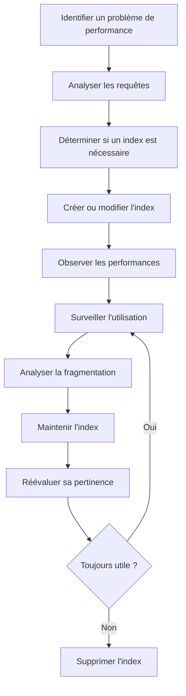

## Ressources

[SQL Index Maintenance - Data With Baraa](https://www.youtube.com/watch?v=n9EWmfrMpZc&t=53s)
[Optimize index maintenance how to improve query performance and reduce resource consumption](https://learn.microsoft.com/en-us/sql/relational-databases/indexes/reorganize-and-rebuild-indexes?view=sql-server-ver17)
