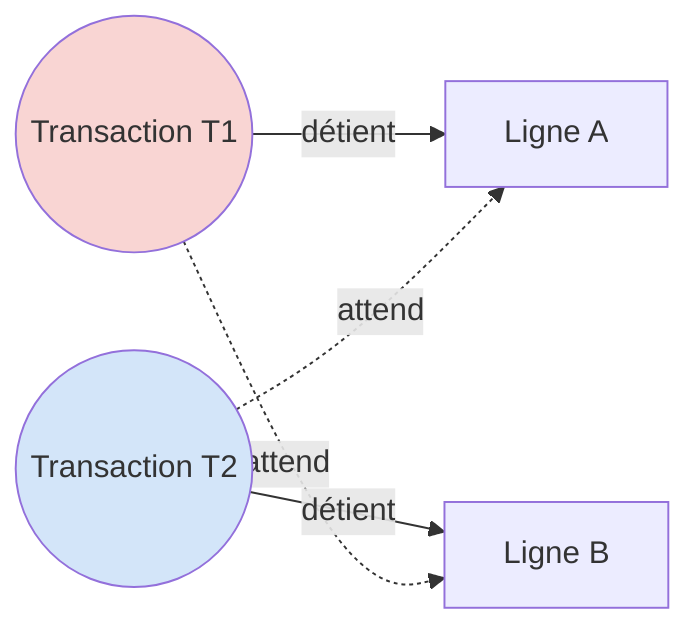
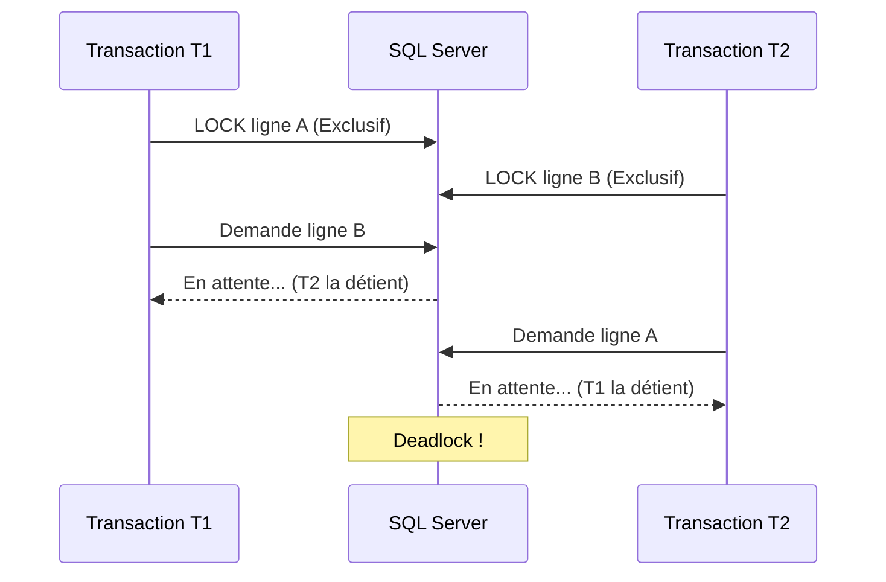
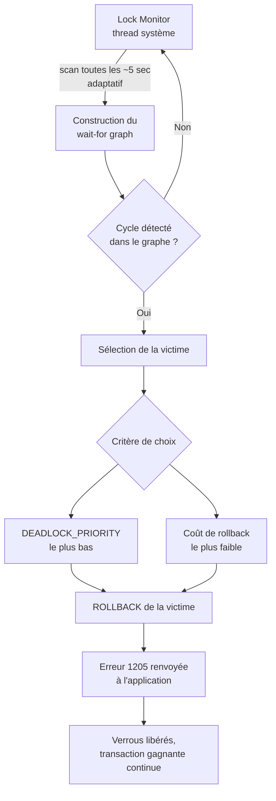

# Objectifs 

Comprendre le mécanisme des deadlocks dans SQL Server, savoir les identifier, les analyser et appliquer des stratégies pour les réduire ou les éviter.

# Contexte
# Wait-For Graph

un cycle dans le graphe des dépendances entre transactions. C'est ce qu'on appelle le **wait-for graph**. Le schéma suivant montre la situation minimale à deux transactions où chacune détient une ressource que l'autre réclame.

## . Séquence temporelle du deadlock

Ce diagramme de séquence retrace l'ordre exact des verrouillages et des demandes qui mènent à l'impasse, jusqu'à l'intervention du moteur SQL Server.

## Comment SQL Server gère (et limite) les deadlocks

**SQL Server ne "prévient" pas les deadlocks — il les détecte et les résout automatiquement**, tout en offrant des outils pour réduire leur fréquence. Il n'existe pas de mécanisme empêchant structurellement leur apparition (contrairement à un ordre de verrouillage strict imposé manuellement).

### Détection automatique — le _Lock Monitor_

- Un thread système dédié, le **Lock Monitor**, tourne en arrière-plan et vérifie périodiquement l'existence de cycles dans le **wait-for graph** (graphe des transactions en attente les unes des autres).
- L'intervalle de scan est **adaptatif** : par défaut autour de 5 secondes, mais il se réduit dynamiquement si des deadlocks sont détectés fréquemment (jusqu'à quelques centaines de millisecondes), afin de réagir plus vite en cas de contention élevée.

### Choix de la victime

Quand un cycle est détecté, SQL Server choisit une **transaction victime** selon deux critères :

1. **`DEADLOCK_PRIORITY`** : chaque session peut définir une priorité (`LOW`, `NORMAL`, `HIGH`, ou une valeur numérique de -10 à 10). La transaction avec la priorité la plus basse est sacrifiée en premier.
2. **Coût estimé du rollback** : à priorité égale, SQL Server choisit la transaction dont l'annulation coûte le moins cher (en termes de journal de transactions à défaire).

La transaction victime reçoit l'erreur **1205** (`Transaction was deadlocked... has been chosen as the deadlock victim`), et l'application doit généralement implémenter une logique de **retry**.

### Techniques pour réduire les deadlocks

| Technique                                                              | Effet                                                                                                                                                   |
| ---------------------------------------------------------------------- | ------------------------------------------------------------------------------------------------------------------------------------------------------- |
| **Accéder aux objets dans le même ordre** dans toutes les transactions | Élimine le risque d'attente circulaire (équivalent d'une prévention manuelle)                                                                           |
| **Transactions courtes**                                               | Réduit la fenêtre temporelle pendant laquelle les verrous sont détenus                                                                                  |
| **Isolation `READ_COMMITTED_SNAPSHOT` ou `SNAPSHOT`**                  | Utilise le **versionnement de lignes (row versioning)** plutôt que des verrous partagés pour les lectures → beaucoup moins de conflits lecteur/écrivain |
| **Index appropriés**                                                   | Réduit la granularité des verrous (évite les _lock escalation_ vers la table entière)                                                                   |
| **`SET DEADLOCK_PRIORITY`**                                            | Contrôle quelle transaction doit être sacrifiée en priorité                                                                                             |
| **Éviter les interactions utilisateur dans une transaction ouverte**   | Empêche qu'une transaction reste bloquée en attendant une saisie externe                                                                                |
# Cas Pratique (Simulation d'un deadlock)

1. 1ière connection 
 
	![[Pasted image 20260725161246.png]]

1. 2éme connection (bloquée)
	![[Pasted image 20260725161349.png]]

+ On remarque que l'une des transaction a été effectuée alors l'autre a été annulée

![[Pasted image 20260725163205.png]]
## Ressources 
[Deadlocks Guide](https://learn.microsoft.com/en-us/sql/relational-databases/sql-server-deadlocks-guide?view=sql-server-ver17)
[Deadlocks: Lets Do One, Understand It, and Fix It](https://www.youtube.com/watch?v=3EwDn9hqgkg)
[Readers–writers problem](https://en.wikipedia.org/wiki/Readers%E2%80%93writers_problem)

