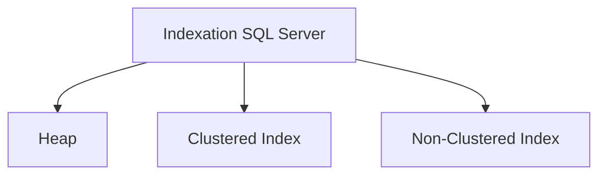
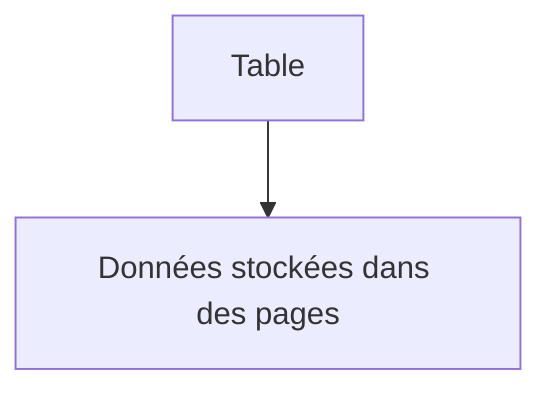
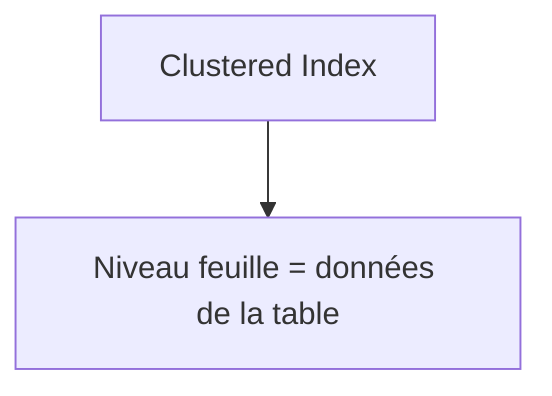
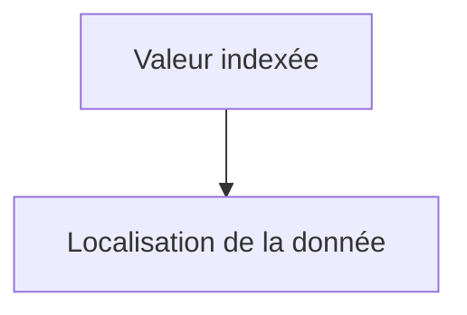
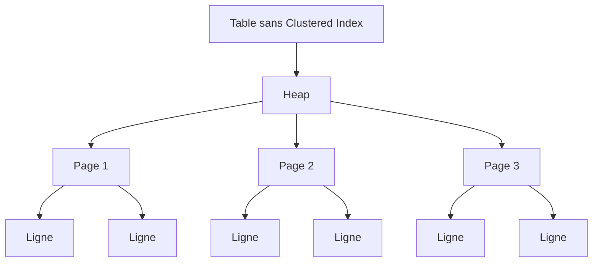
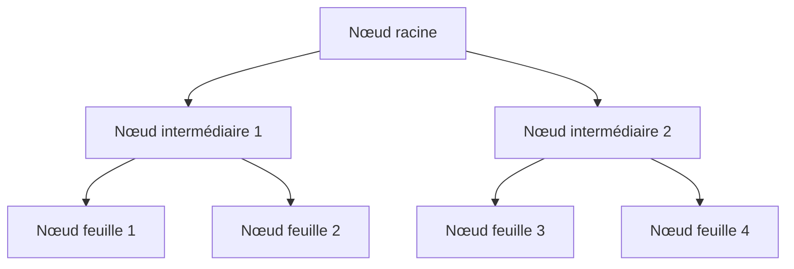
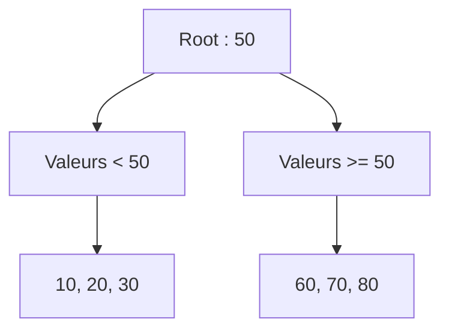
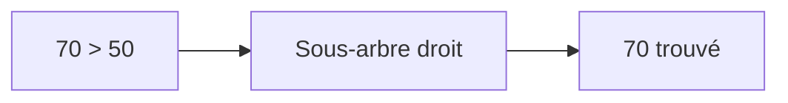
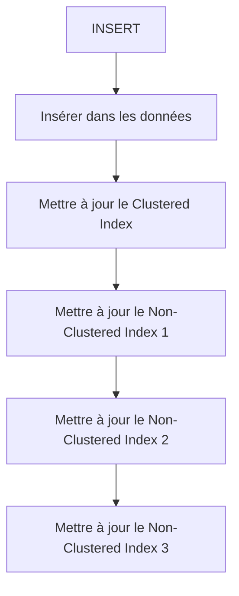

## Objectifs

> [!info] étudier le fonctionnement des index et leur rôle dans l'amélioration des performances des requêtes.


# Contexte

Un index est une structure de données supplémentaire permettant au moteur de base de données de localiser plus rapidement les lignes recherchées.

> [!warning] Compromis Les index ont également un coût en espace disque et en opérations d'écriture.

Les principaux concepts étudiés sont :

- les différents types d'index ;
- la structure d'un Heap ;
- la structure d'un B-Tree ;
- les Clustered Indexes ;
- les Non-Clustered Indexes ;
- les avantages et compromis entre Clustered et Non-Clustered Indexes.

## 1. Types d'index

Dans SQL Server, les deux structures fondamentales étudiées sont :



### Heap

Une table sans Clustered Index est appelée un **Heap**.



### Clustered Index

Un Clustered Index organise les données de la table selon la clé de l'index.



### Non-Clustered Index

Un Non-Clustered Index est une structure séparée contenant :



## 2. Structure d'un Heap

Un Heap est une table qui ne possède pas de Clustered Index.

> [!note] Remarque Les données sont stockées dans des pages sans organisation basée sur une clé d'index.



Les lignes ne sont donc pas organisées selon une clé de recherche particulière.

Par exemple :

```text
Page 1
┌────────────────────┐
│ CustomerId = 50    │
│ CustomerId = 3     │
│ CustomerId = 100   │
└────────────────────┘

Page 2
┌────────────────────┐
│ CustomerId = 12    │
│ CustomerId = 7     │
│ CustomerId = 90    │
└────────────────────┘
```

> [!danger] Conséquence Si aucune structure d'index ne permet de localiser rapidement une ligne, SQL Server peut être obligé de parcourir plusieurs pages afin de trouver les données recherchées.

## 3. Structure B-Tree

Les index relationnels utilisent généralement une structure arborescente équilibrée de type **B-Tree**.

Un B-Tree est composé de plusieurs niveaux :



La recherche suit généralement le chemin :


Par exemple :



Pour rechercher la valeur `70` :



Au lieu de parcourir toutes les lignes de la table, le moteur suit une série de niveaux dans l'arbre.

> [!success] Avantage Cette structure permet généralement une recherche logarithmique (`O(log n)`) au lieu d'un parcours séquentiel (`O(n)`).

## 4. Clustered Index

Un **Clustered Index** détermine l'organisation des données de la table.

Dans SQL Server, les données elles-mêmes se trouvent au niveau feuille du Clustered Index.
![[Pasted image 20260720115337.png]]

> [!info] Caractéristique essentielle Le niveau feuille du Clustered Index contient directement les données de la table.

Par exemple :

```sql
CREATE CLUSTERED INDEX IX_Customers_CustomerId
ON Customers(CustomerId);
```

La table est alors organisée physiquement autour de la clé :


> [!warning] Limitation Une table ne peut avoir qu'un seul Clustered Index, car les données ne peuvent être physiquement organisées selon plusieurs ordres différents en même temps.

## 5. Non-Clustered Index

Un **Non-Clustered Index** est une structure indépendante de la table principale.

Il contient généralement :


Exemple :

```sql
CREATE NONCLUSTERED INDEX IX_Customers_Email
ON Customers(Email);
```

La structure peut être représentée ainsi :

![[Pasted image 20260720115521.png]]

## 6.Clustered VS Non Clustered Index
### Avantages du Clustered Index

>[!success] Un Clustered Index peut être particulièrement efficace pour :
>- la recherche sur la clé
>- les requêtes par intervalle
>- le tri selon la clé
>- l'accès séquentiel aux données (qui changent rarement)

Exemple :

```sql
SELECT *
FROM Orders
WHERE OrderId BETWEEN 1000 AND 2000;
```

> [!tip] Bon à savoir Les données sont organisées selon la clé de l'index, ce qui facilite les recherches par intervalle. Un autre avantage est que le moteur peut accéder directement aux données au niveau feuille.

### Inconvénients du Clustered Index

Le principal compromis est que les données ne peuvent être organisées que selon un seul ordre principal.

Une table ne peut donc posséder qu'un seul Clustered Index. De plus, le choix de la clé est important.

> [!danger] Risque Une mauvaise clé peut provoquer :
> 
> - de la fragmentation
> - des déplacements de pages
> - des opérations d'écriture plus coûteuses

### Avantages du Non-Clustered Index

>[!success]
> + Une table peut posséder plusieurs Non-Clustered Indexes. Cela permet d'optimiser différents scénarios de recherche
> + Efficace pour les recherches sur des valeurs exactes 
> + Efficace pour les opérations d'écriture (index indépendant de l'ordre physique de données) mais ça dépend le nombre des indexes sur les colonnes aussi
### Inconvénients du Non-Clustered Index

Chaque Non-Clustered Index est une structure supplémentaire.

> [!warning] Coût Il consomme donc :
> 
> - de l'espace disque
> - de la mémoire
> - un coût de maintenance

Lorsqu'une ligne est insérée :



## 7. Résumé des compromis

| Caractéristique                | Clustered Index                  | Non-Clustered Index           |
| ------------------------------ | -------------------------------- | ----------------------------- |
| Nombre par table               | Un seul                          | Plusieurs possibles           |
| Données au niveau feuille      | Oui                              | Non                           |
| Structure séparée de la table  | Non                              | Oui                           |
| Accès direct aux données       | Oui                              | Peut nécessiter un Key Lookup |
| Recherche par intervalle       | Très adaptée                     | Adaptée selon la clé          |
| Coût en espace                 | Structure principale des données | Espace supplémentaire         |
| Nombre de structures possibles | Une                              | Plusieurs                     |

## Conclusion

L'étude des index a permis de comprendre que l'indexation repose principalement sur différentes structures de données.

> [!success] Synthèse
> 
> - Un **Heap** stocke les données sans organisation basée sur un index Clustered.
> - Un **B-Tree** fournit une structure hiérarchique permettant de rechercher efficacement les valeurs.
> - Un **Clustered Index** organise directement les données de la table selon une clé.
> - Un **Non-Clustered Index** constitue une structure séparée permettant de retrouver rapidement les données grâce à une clé et une référence vers leur localisation.

Le choix entre ces structures représente un compromis entre :
+ Performance des lectures
+ Coût des écritures
+ Espace disque

L'indexation doit donc être conçue en fonction des accès réels aux données et des besoins de l'application.

# Cas pratique 

+ Temps d'excution sans index (~ 3.296 secondes) pour une table 100K lignes 

	![[Screenshot From 2026-07-20 13-23-44.png]]

+ Temps d'excution aprés l'ajout d'un index non-clustered (~ 0.007 secondes)  pour la meme table

	![[Screenshot From 2026-07-20 13-28-34.png]]


## Ressources

- [SQL Indexes (Visually Explained) - Data With Baraa](http://youtube.com/watch?v=BxAj3bl00-o)
