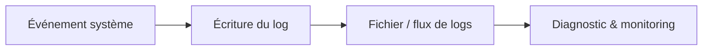
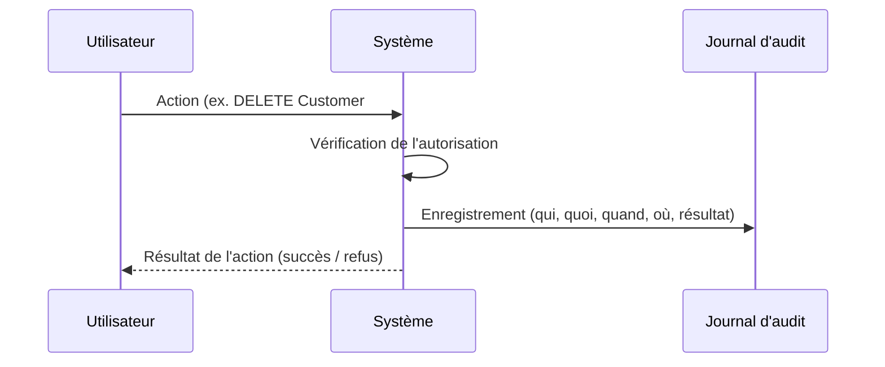
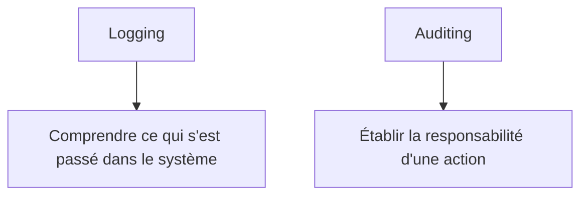
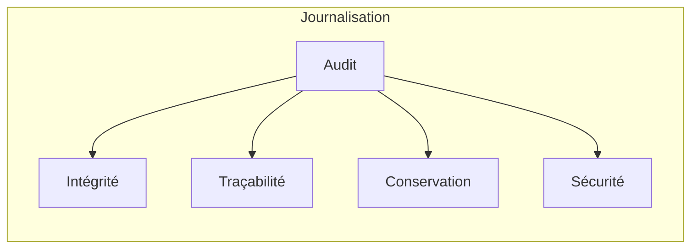
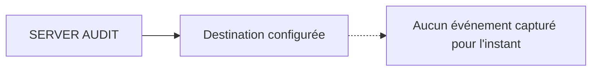
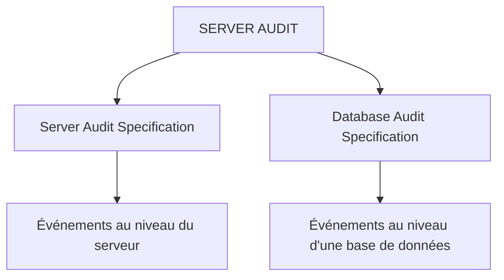

## Objectifs

> [!info] Objectif Comprendre la notion d'**audit informatique** ainsi que sa différence avec la simple **journalisation (logging)**.

## La journalisation (Logging)

La journalisation consiste à enregistrer les événements qui se produisent dans un système.

Par exemple, une application peut enregistrer :

```
2026-07-18 14:30:01
INFO: Database connection established
```

Ou encore :

```text
2026-07-18 14:32:15
ERROR: Database connection failed
```

Ces informations permettent principalement de comprendre le fonctionnement du système et de diagnostiquer des problèmes.

Les logs peuvent être utilisés pour :

- détecter des erreurs ;
- diagnostiquer des problèmes ;
- analyser les performances ;
- surveiller les services ;
- comprendre le comportement d'une application ;
- détecter des incidents techniques.

> [!tip] Question clé La question principale à laquelle répond la journalisation est donc : **Qu'est-ce qui s'est passé dans le système ?**



## L'audit

L'audit consiste également à enregistrer des événements, mais son objectif principal est de garantir la **traçabilité** et la **responsabilité** des actions.

Un audit cherche notamment à répondre aux questions suivantes :

- Qui a effectué l'action ?
- Quelle action a été effectuée ?
- Sur quelle ressource ?
- Quand l'action a-t-elle eu lieu ?
- L'action était-elle autorisée ?
- L'action a-t-elle réussi ou échoué ?

Par exemple :

```text
Utilisateur : Alice
Action      : DELETE
Ressource   : Customer #123
Date        : 2026-07-18 14:30:01
Résultat    : SUCCESS
Adresse IP  : 192.168.1.10
```

> [!note] Remarque Ce type d'information permet de savoir précisément **qui a effectué une opération importante**.

Un audit peut également enregistrer les tentatives échouées :

```text
Utilisateur : Bob
Action      : DELETE
Ressource   : CustomerData
Autorisation: REFUSED
Date        : 2026-07-18 14:35:10
```

L'audit ne s'intéresse donc pas uniquement aux erreurs techniques. Il s'intéresse également aux **actions des utilisateurs et à leur autorisation**.

> [!tip] Question clé La question principale à laquelle répond l'audit est donc : **Qui a fait quoi, quand, sur quelle ressource et avec quel résultat ?**



## Comparaison entre Logging et Auditing

|Logging|Auditing|
|---|---|
|Enregistre les événements du système|Enregistre les actions importantes et traçables|
|Sert principalement au diagnostic|Sert principalement à la responsabilité et à la sécurité|
|Utilisé par les développeurs et les équipes DevOps|Utilisé par les équipes de sécurité et d'audit|
|Peut contenir des erreurs et des événements techniques|Doit permettre d'identifier l'auteur d'une action|

> [!info] Résumé La distinction peut être résumée ainsi :



## La frontière entre les deux concepts

La distinction entre logging et auditing n'est pas toujours absolue.

Techniquement, un audit peut être considéré comme une forme particulière de journalisation. Cependant, les événements d'audit ont généralement des exigences supplémentaires.



> [!warning] Exigences d'un audit Un audit doit souvent garantir :
> 
> **L'intégrité** — Les informations enregistrées ne doivent pas pouvoir être facilement modifiées.
> 
> **La traçabilité** — Il doit être possible d'identifier précisément l'auteur d'une action.
> 
> **La conservation** — Les événements peuvent devoir être conservés pendant une longue période.
> 
> **La sécurité** — Les utilisateurs ne doivent pas pouvoir facilement supprimer ou modifier leurs propres traces d'audit.

## Le Server Audit

> [!info] Rôle Le `SERVER AUDIT` définit principalement la destination des événements. Il répond à la question : **Où les événements d'audit doivent-ils être écrits ?**

Exemple :

> [!warning] Attention Cependant, cette instruction seule ne signifie pas encore que SQL Server capture toutes les actions. Elle définit simplement la destination configurée pour l'audit.



> [!note] Étape suivante Il faut ensuite créer une spécification indiquant les événements à capturer.

## Les Audit Specifications

Il existe principalement deux types de spécifications.



### Server Audit Specification

Elle permet d'auditer les événements au niveau du serveur.

Exemples :

- connexions réussies ;
- connexions échouées ;
- création de login ;
- modification de login ;
- changement de rôle serveur ;
- création de base de données ;
- suppression de base de données.

### Database Audit Specification

Elle permet d'auditer les actions à l'intérieur d'une base de données.

Exemples d'actions auditables :

- `SELECT`
- `INSERT`
- `UPDATE`
- `DELETE`
- `CREATE TABLE`
- `ALTER TABLE`
- `DROP TABLE`
- `EXECUTE PROCEDURE`
# Cas Pratique 

+ La creation d'un server audit 

	![[Pasted image 20260718132621.png]]

+ La creation d'une spécificqation d'audit pour la base de ArchiveDb  
	![[Screenshot From 2026-07-18 13-38-09.png]]

+ La journal d'audits aprés l'application de quelques actions
![[Screenshot From 2026-07-18 13-39-15.png]]

# Ressources

[Create a Server Audit and Server Audit Specification](https://learn.microsoft.com/en-us/sql/relational-databases/security/auditing/create-a-server-audit-and-server-audit-specification?view=sql-server-ver17)

