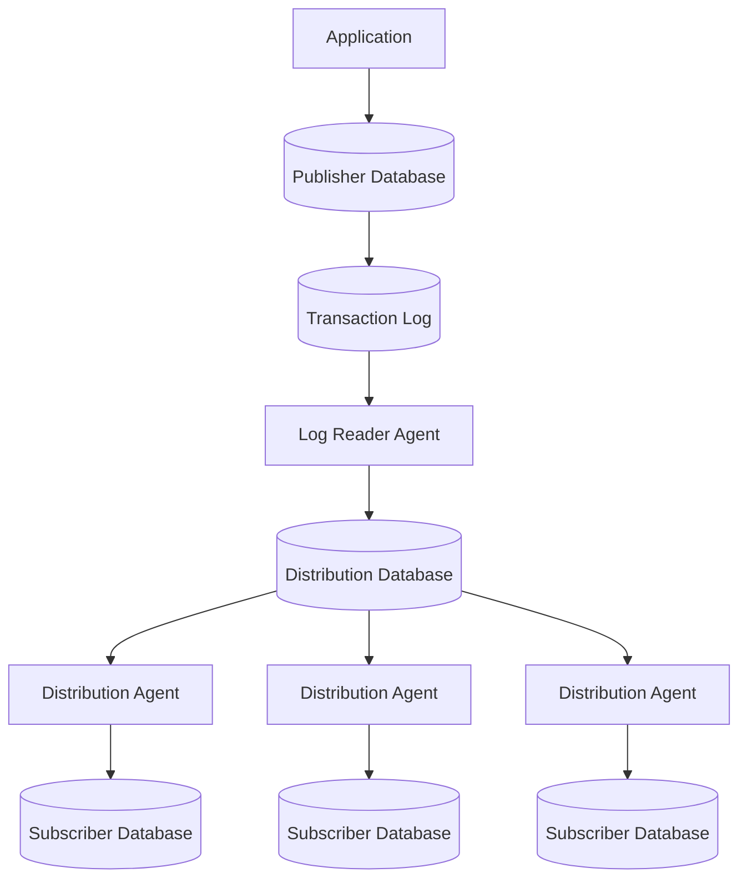
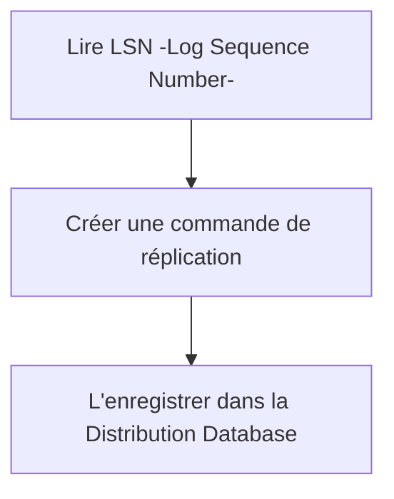
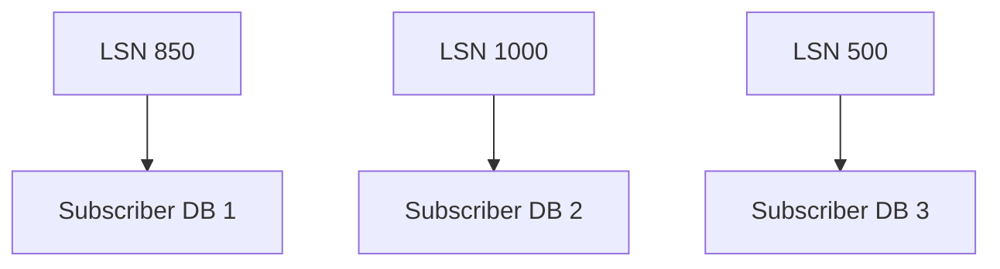
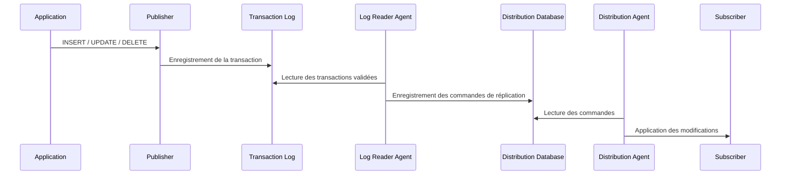

## Objectifs

> [!info] Objectif Le but est d'étudier le fonctionnement interne de la réplication transactionnelle dans SQL Server.

## Contexte

![[replication-of-one-leader-and-multi-follower.png]]

> [!info] Définition La **réplication** est un mécanisme permettant de **copier et synchroniser automatiquement des données entre plusieurs bases SQL Server**. Une base de données est désignée comme source principale des données (Publisher), tandis que les autres reçoivent automatiquement les modifications effectuées sur cette dernière (Subscribers).

> [!warning] Précision L'objectif n'est pas de remplacer les sauvegardes mais de **distribuer les données** vers plusieurs serveurs (Backup vs Replication).

## Pourquoi utiliser la réplication ?

La réplication est utilisée pour résoudre plusieurs problématiques :

1. Déporter les requêtes décisionnelles (Business Intelligence) vers une base répliquée afin d'éviter de surcharger la base de données transactionnelle (OLTP). Seules les tables nécessaires aux rapports sont répliquées (Load Balancing).
2. Les applications web peuvent rediriger les requêtes de lecture vers les bases abonnées (**Subscribers**), tandis que toutes les opérations d'écriture continuent d'être effectuées sur le **Publisher**.
3. Alimenter des systèmes en aval (entrepôts de données, plateformes analytiques, solutions de Business Intelligence, etc.) sans leur donner un accès direct à la base de données de production.

...etc

## Types de réplication

### Architecture générale



## Composants

### Publisher

Le **Publisher** est le serveur SQL contenant les données de référence. Toutes les opérations réalisées par les applications (INSERT, UPDATE, DELETE) sont exécutées sur cette base. Il constitue la **source officielle des données**. Le Publisher ne communique pas directement avec les Subscribers. Son rôle est uniquement d'enregistrer les transactions dans son journal de transactions.

- Stocker les données de production.
- Enregistrer toutes les transactions.
- Définir les publications et les articles à répliquer.

### Transaction Log

Le **Transaction Log** est un fichier propre à chaque base SQL Server. Toutes les modifications effectuées sur la base y sont enregistrées avant d'être définitivement validées (journal de modification).

### Log Reader Agent

Le **Log Reader Agent** est un processus exécuté par **SQL Server Agent**. Contrairement au moteur SQL Server, il s'agit d'un programme indépendant chargé de surveiller le Transaction Log. Son rôle consiste à :

1. Lire les transactions validées.
2. Identifier celles qui doivent être répliquées.
3. Les convertir en commandes de réplication.
4. Les enregistrer dans la Distribution Database.

> [!note] Remarque Le Log Reader ne modifie jamais les données. Il agit uniquement comme un lecteur du journal.



### Base de données de distribution

La **Distribution Database** est une base SQL Server dédiée à la réplication. Elle joue le rôle d'une **file de messages persistante**.

Elle stocke temporairement toutes les commandes qui devront être envoyées aux différents Subscribers. Elle contient également :

- les commandes de réplication
- l'état des abonnés
- les informations sur les agents
- l'historique des synchronisations
- les erreurs éventuelles

Chaque Subscriber lit les commandes à son propre rythme.

> [!tip] Pourquoi ne pas lire directement le Transaction Log ? Pourquoi ne lit-on pas directement à partir du Transaction Log de la base de données principale ?
> 
> 1. Le Publisher devrait suivre l'état de chaque Subscriber, ce qui n'est pas scalable s'il y a plusieurs BD de réplication.
> 2. Le Transaction Log devrait être conservé beaucoup plus longtemps.
> 
> La BD de distribution permet de découpler complètement le Publisher des Subscribers.

### Distribution Agent

L'agent de distribution est un autre processus exécuté par SQL Server Agent. Il récupère les commandes présentes dans la Distribution Database puis les applique sur chaque Subscriber.

Pour chaque abonné, il mémorise jusqu'à quelle transaction les données ont été synchronisées. Son fonctionnement est similaire à celui d'un consommateur dans une file de messages.



### Subscriber

Le **Subscriber** est une base SQL Server recevant les données répliquées. Selon le type de réplication :

- il peut être utilisé uniquement en lecture (Read-Replica)
- ou autoriser également les modifications (Read-Write Replica)

Pour une réplication transactionnelle, les Subscribers sont généralement utilisés afin de :

- exécuter les requêtes de consultation
- produire des rapports
- alimenter des outils décisionnels

> [!success] Bénéfice Les applications effectuent alors leurs lectures sur les Subscribers afin de réduire la charge du Publisher.

## Interaction entre les composants

Le cycle complet de la réplication transactionnelle est le suivant :



## Cas Pratique

- Création d'une instance SQL Server qui joue le rôle d'une BD de réplication :
    
	![[Pasted image 20260717122455.png]]
    

> [!info] Prérequis réseau On s'assure que les deux instances SQL Server (Publisher & Subscriber) sont connectées, en vérifiant qu'elles se trouvent sur le même réseau (replication network), afin que les agents de distribution puissent communiquer avec les BD Subscribers.

![[Pasted image 20260714155743.png]]

Ou à partir du Rider IDE :

![[Pasted image 20260716173130.png]]

- Configuration de la BD de distribution (dans ce cas, Publisher & Distributor existent dans la même instance SQL Server) :
    
    ![[Pasted image 20260717092146.png]]
    
- Configuration de la BD Publisher et création d'un Publisher :
    
    ![[Pasted image 20260717092242.png]]
    
- Création d'une publication (collection des articles) et ajout d'un snapshot initial :
    
    ![[Pasted image 20260717092530.png]]
    
- Un script T-SQL pour ajouter toutes les tables définies par l'utilisateur à la publication déjà créée :
    
    ![[Screenshot From 2026-07-17 09-26-45.png]]
    
- Création d'un Subscriber & d'une Subscription :
    
    ![[Screenshot From 2026-07-17 09-29-18 2.png]]
    
- Création d'un Login et d'un utilisateur (au niveau de la base de données répliquée) :
    
    ![[Pasted image 20260717093225.png]]
    
- Configuration de l'agent de distribution :
    
    ![[Screenshot From 2026-07-17 09-33-57.png]]
    
- Création d'un snapshot initial :
    
    ![[Screenshot From 2026-07-17 09-34-38.png]]
    
### Résultats

- Fichiers initiaux de réplication (initial snapshot) :
    
    ![[Pasted image 20260717093553.png]]
    
- Au niveau de la base de données de destination (log files) :
    
    ![[Pasted image 20260717093710.png]]
    
- Vérification à l'aide de commandes SQL :
    

```sql
use ArchiveDbRepl;

select name
from sys.tables;
```

![[Pasted image 20260717093753.png]]

> [!success] Bilan La publication est correctement créée sur le Publisher, distribuée via l'agent de distribution et reçue par le Subscriber, confirmant le bon fonctionnement de la chaîne de réplication transactionnelle.

## Ressources

- [Docker Networking overview](https://docs.docker.com/engine/network)
- [Configure Replication with T-SQL](https://learn.microsoft.com/en-us/sql/linux/replication/tutorial-tsql?view=sql-server-ver16) 