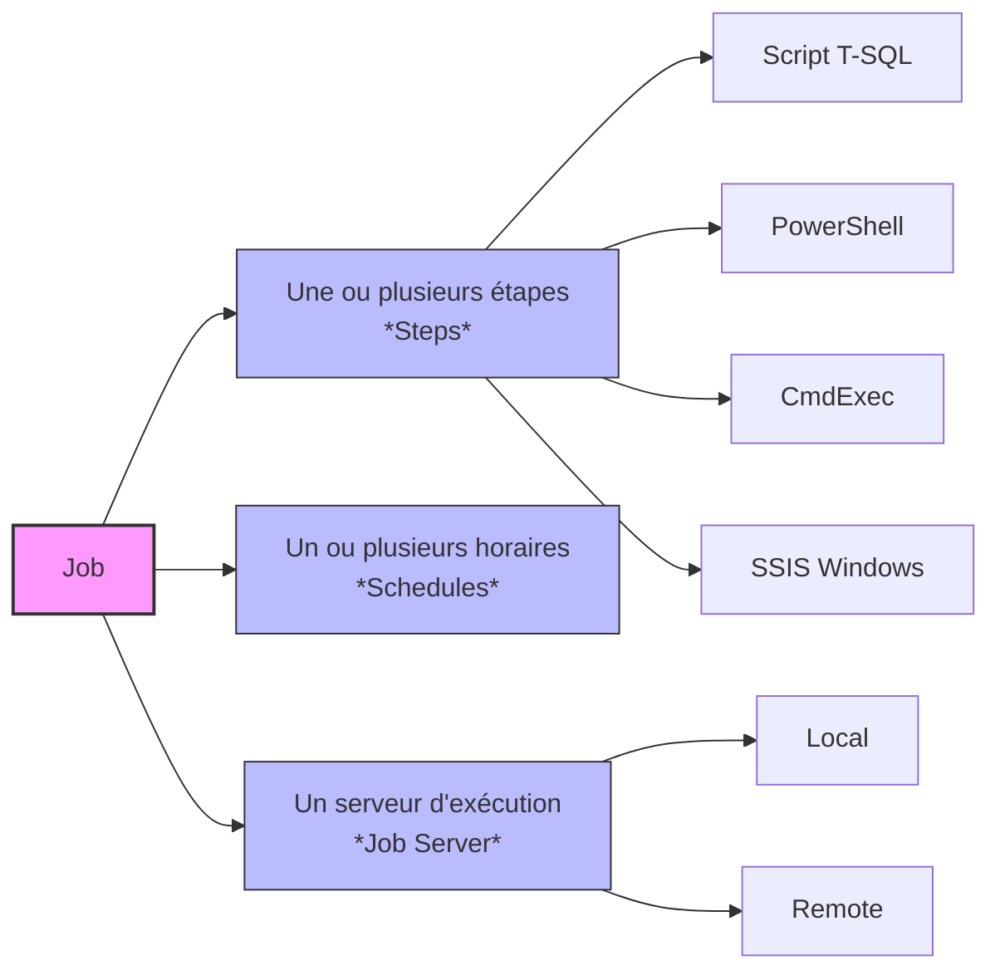

## Objectifs

> [!info] Étudier le fonctionnement des **SQL Server Agent Jobs** et apprendre à les créer, les planifier et les administrer sans utiliser SQL Server Management Studio (SSMS), afin de disposer d'une solution compatible avec un environnement Linux et facilement automatisable.

## Contexte

SQL Server Agent est le composant de SQL Server chargé d'exécuter automatiquement des tâches planifiées telles que :

- les sauvegardes automatiques
- la maintenance des bases de données
- l'exécution de scripts T-SQL
- les tâches ETL
- les opérations d'administration

> [!warning] Particularité Linux Sous Linux, SQL Server Management Studio n'est pas disponible. Il est donc nécessaire de manipuler directement SQL Server Agent à l'aide de commandes T-SQL.

## Les procédures stockées principales

> [!note] Remarque Les Jobs sont stockés dans la base système `msdb`.

Microsoft fournit plusieurs procédures stockées permettant de manipuler les Jobs.

### Gestion des Jobs

| But              | Stored Procedure    |
| ---------------- | ------------------- |
| Create job       | `sp_add_job`        |
| Delete job       | `sp_delete_job`     |
| Add step         | `sp_add_jobstep`    |
| Update step      | `sp_update_jobstep` |
| Delete step      | `sp_delete_jobstep` |
| Attach to server | `sp_add_jobserver`  |
| Start job        | `sp_start_job`      |
| Stop job         | `sp_stop_job`       |

### Gestion des plans

|But|Stored Procedure|
|---|---|
|Create schedule|`sp_add_schedule`|
|Update schedule|`sp_update_schedule`|
|Attach schedule|`sp_attach_schedule`|
|Detach schedule|`sp_detach_schedule`|

### Consultation des informations

| But              | Stored Procedure     |
| ---------------- | -------------------- |
| View jobs        | `sp_help_job`        |
| View schedules   | `sp_help_schedule`   |
| View job history | `sp_help_jobhistory` |

## Cas Pratique

> [!info] Scénario On veut créer un job qui effectue un full backup chaque samedi à 2 h du matin.

1. On crée une procédure stockée pour simplifier l'enregistrement de la tâche et pour tester la procédure elle-même :
    
    ![[Pasted image 20260713105535.png]]
    
2. On crée une tâche en spécifiant la commande SQL à exécuter :
    
    ![[Pasted image 20260713105858.png]]
    
3. On crée un plan d'exécution :
    
    ![[Screenshot From 2026-07-13 11-01-10.png]]
    
4. On attache la tâche au plan adéquat :
    
    ![[Pasted image 20260713110208.png]]
1. On attache la tâche au sql server agent:
	![[Pasted image 20260721161249.png]]

> [!success] Résultat Le job de full backup est désormais créé, planifié et rattaché à son horaire d'exécution, sans passer par SSMS.

## Ressources

- [SQL Server Agent Overview](https://learn.microsoft.com/en-us/ssms/agent/sql-server-agent?source=recommendations)