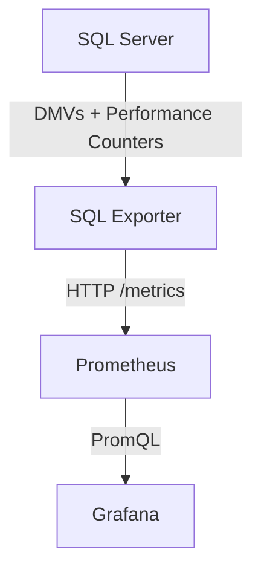
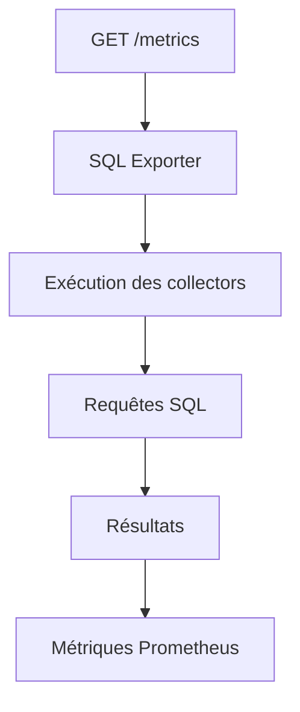
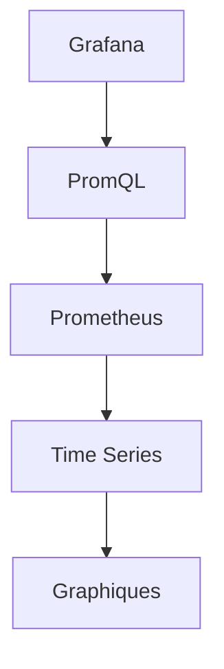
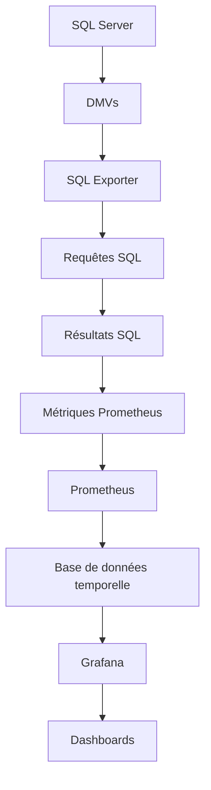

## Objectif de la journée

> [!info] Objectif Mettre en place une solution de **monitoring** (sans logs ni tracing) permettant de :
> 
> - Surveiller l'état de SQL Server
> - Collecter des métriques de performance
> - Stocker les métriques dans le temps
> - Visualiser les données dans Grafana

## Architecture



Chaque composant possède un rôle bien défini.

## 1. SQL Server

SQL Server ne fournit pas directement des métriques compatibles avec Prometheus.

Les informations sont disponibles via :

- Dynamic Management Views (DMVs)
- Catalog Views
- Performance Counters

Exemples de données disponibles :

- CPU
- Mémoire
- Connexions
- I/O

## 2. SQL Exporter

> [!tip] Rôle Le SQL Exporter agit comme un **traducteur** entre SQL Server et Prometheus.

Son fonctionnement :

1. Prometheus demande `/metrics`
2. Le SQL Exporter exécute des requêtes SQL
3. Les résultats sont convertis au format Prometheus
4. Les métriques sont renvoyées à Prometheus

Flux :



### Les Collectors

Un collector correspond à un domaine fonctionnel.

Exemples :

```text
availability.collector.yml
cpu.collector.yml
memory.collector.yml
```

Chaque collector contient :

- une ou plusieurs requêtes SQL
- la définition des métriques
- les labels
- le type de métrique (Gauge ou Counter)

### Les métriques

**Gauge**

Valeur instantanée. Peut augmenter ou diminuer.

Exemples :

- CPU
- Mémoire
- Connexions
- Taille des bases
- Page Life Expectancy

**Counter**

Compteur qui augmente continuellement.

Exemples :

- Transactions
- Batch Requests
- Deadlocks
- Lectures disque

Pour obtenir une vitesse, Prometheus utilise :

```promql
rate(counter[5m])
```

### Labels

Les labels permettent d'ajouter du contexte aux métriques.

Exemple :

```text
mssql_database_size{
    database="Sales"
}
```

> [!tip] Astuce Au lieu d'avoir une métrique différente pour chaque base, une seule métrique est utilisée avec des labels.

Avantages :

- filtrage
- regroupement
- agrégation

## 3. Prometheus

Prometheus est responsable de :

- découvrir les cibles
- récupérer les métriques
- stocker les séries temporelles

À chaque `scrape_interval`, il exécute :

```text
GET http://sql-exporter:9399/metrics
```

Puis il stocke :

- timestamp
- metric
- labels
- value

### Configuration de Prometheus

Le fichier principal est :

```text
prometheus.yml
```

Il contient principalement les paramètres globaux :

```yaml
global:
  scrape_interval: 15s
  scrape_timeout: 10s
  evaluation_interval: 15s
```

**`scrape_interval`** — Fréquence de collecte. Valeur recommandée : 15 secondes.

**`scrape_timeout`** — Temps maximal accordé à un exporter pour répondre.

> [!warning] Règle à respecter `scrape_timeout` doit toujours être inférieur à `scrape_interval`.

**`evaluation_interval`** — Fréquence d'évaluation des règles Prometheus.

> [!note] Remarque Même sans alertes, il est conseillé de la garder égale au `scrape_interval`.

### Les Jobs

Chaque cible est définie dans un **job**.

Exemple :

```yaml
scrape_configs:

- job_name: sqlserver

  static_configs:

  - targets:
      - sql-exporter:9399
```

Le job représente une source de métriques.

### Les Targets

Une target correspond à un endpoint HTTP exposant des métriques.

Exemple :

```text
sql-exporter:9399
```

Prometheus effectue :

```text
GET /metrics
```

### Les Rules

Prometheus possède deux types de règles :

**Recording Rules** — Calculent automatiquement des expressions PromQL.

Exemple :

```promql
rate(mssql_batch_requests_total[5m])
```

Le résultat est stocké comme une nouvelle métrique.

Avantages :

- dashboards plus rapides
- moins de calculs
- meilleure scalabilité

**Alerting Rules** — Déclenchent des alertes.

> [!note] Remarque Dans notre démo, les rules ne sont pas utilisées.

## 4. Grafana

> [!info] Rôle Grafana ne stocke aucune donnée. Il :
> 
> - interroge Prometheus
> - exécute des requêtes PromQL
> - affiche les résultats sous forme de graphiques

Flux :



## Cycle complet du monitoring



## Test

### La mise en place des conteneurs Docker

![[Pasted image 20260708124337.png|697]]

### Les visualisations Grafana de la base de données par défaut (master) dans l'état normal (no stress test)

![[Pasted image 20260710114803.png]]

![[Pasted image 20260710114853.png]]

![[Pasted image 20260710114944.png]]

> [!success] Bilan Les métriques CPU, mémoire, connexions et I/O de la base `master` sont correctement remontées dans Grafana via Prometheus et le SQL Exporter, confirmant le bon fonctionnement de la chaîne de monitoring.

# Ressources

[Prometheus and Grafana for Monitoring and Observability - For Beginners](https://www.youtube.com/@DOLFINED)
[Burning Alchemist SQL Exporter Documentation](https://github.com/burningalchemist/sql_exporter)
