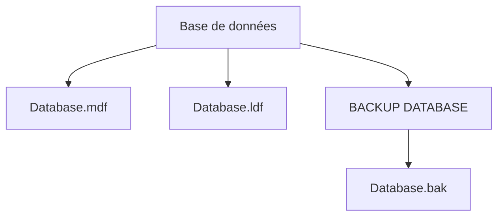
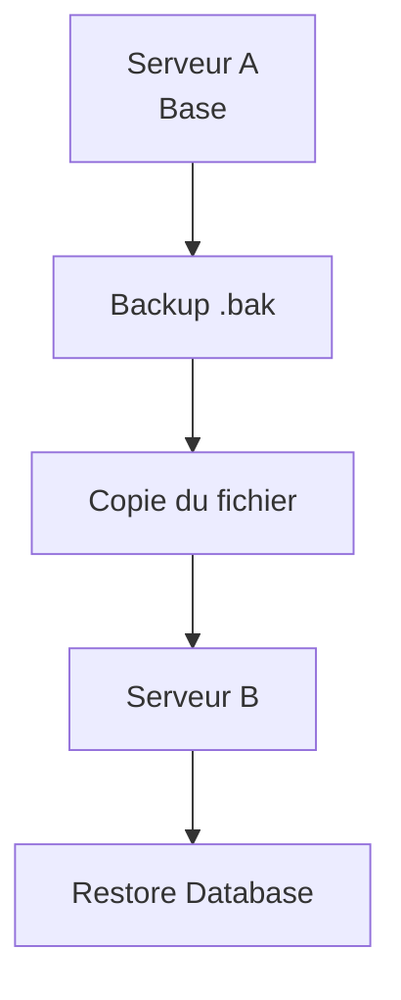

## Objectifs

> [!info] Être capable de comprendre le fonctionnement des sauvegardes et des restaurations dans SQL Server, de créer différents types de sauvegardes et de restaurer une base de données en toute sécurité.

## Contexte

Un fichier **`.bak`** est une **sauvegarde (backup)** d'une base de données SQL Server. Il contient toutes les informations nécessaires pour recréer la base de données à un moment précis.

> [!warning] Important Un fichier `.bak` n'est pas la base de données elle-même, mais une copie de celle-ci.

## Structure des fichiers SQL Server

Lorsqu'une base de données est créée, SQL Server génère généralement deux fichiers principaux :

|Fichier|Rôle|
|---|---|
|`.mdf`|Fichier principal contenant les données (tables, index, vues, procédures stockées, etc.)|
|`.ldf`|Journal des transactions (Transaction Log)|

Le fichier **`.bak`** est créé uniquement lorsqu'une sauvegarde est effectuée.



## Que contient un fichier .bak ?

> [!note] Contenu d'une sauvegarde complète
> 
> - Tables
> - Données
> - Index
> - Contraintes
> - Clés primaires / étrangères
> - Vues
> - Procédures stockées
> - Fonctions
> - Triggers
> - Métadonnées
> - Une partie des informations de sécurité

## Pourquoi effectuer une sauvegarde ?

Les sauvegardes permettent de :

- Restaurer une base après une panne
- Récupérer des données supprimées accidentellement
- Déplacer une base vers un autre serveur
- Créer un environnement de test
- Revenir à une version antérieure

## Création d'une sauvegarde

```sql
BACKUP DATABASE ShopDatabase
TO DISK = 'C:\Backups\ShopDatabase.bak'
WITH FORMAT,
INIT,
NAME = 'Full Backup';
```

### Explication

- `TO DISK` : emplacement du fichier de sauvegarde.
- `FORMAT` : crée un nouveau média de sauvegarde.
- `INIT` : écrase le fichier existant.
- `NAME` : nom descriptif de la sauvegarde.

> [!danger] Attention `INIT` écrase le fichier de sauvegarde existant au même emplacement — toute sauvegarde précédemment stockée dans ce fichier sera perdue.

## Comment fonctionne une sauvegarde ?

SQL Server :

1. Lit toutes les pages utilisées de la base.
2. Vérifie leur cohérence.
3. Les compresse (si activé).
4. Les écrit dans le fichier `.bak`.

> [!tip] Bon à savoir La base reste généralement disponible pendant toute l'opération.

## Restaurer une base

```sql
RESTORE DATABASE ShopDatabase
FROM DISK = 'C:\Backups\ShopDatabase.bak';
```

SQL Server recrée alors :

- le fichier `.mdf`
- le fichier `.ldf`
- les tables
- les données
- les index
- tous les objets de la base

## Déplacer une base de données



> [!tip] Bonne pratique Cette méthode est plus sûre que copier directement les fichiers `.mdf` et `.ldf`.

## Types de sauvegardes

### 1. Full Backup

Sauvegarde complète. À utiliser comme point de départ de toute restauration.

### 2. Differential Backup

Contient uniquement les modifications effectuées depuis la dernière sauvegarde complète.

Exemple :

```
Dimanche
Full Backup

Lundi
100 lignes modifiées

Mardi
200 lignes modifiées

Differential Backup
= 300 lignes modifiées
```

Pour restaurer :

```
Full Backup
      ↓
Differential Backup
```

### 3. Transaction Log Backup (Log Shipping)

Sauvegarde les transactions enregistrées dans le journal (`.ldf`).

Exemple :

```
INSERT
UPDATE
DELETE
INSERT
UPDATE
```

> [!info] Point-in-Time Recovery Permet une restauration **à un instant précis (Point-in-Time Recovery)**.

Exemple :

```
12:00  Full Backup
12:15  Log Backup
12:30  Log Backup
12:45  Log Backup
12:50  Crash
```

Restauration :

```
Full Backup
      ↓
12:15 Log
      ↓
12:30 Log
      ↓
12:45 Log
```

> [!success] Résultat La base est restaurée quasiment à l'instant de la panne.

## Cas Pratique

- Full backup de la base de données ShopDb :
    
    ![[Pasted image 20260710125850.png]]
    
- Inspection des fichiers sauvegardés :
    
    ![[Pasted image 20260710130222.png]]
    
- Differential Backup :
    
    ![[Pasted image 20260710131715.png]]
    
- Transaction Logs Backup :
    
    ![[Pasted image 20260710132316.png]]
    
- Restauration de la base de données (full backup + differential backup + log transactions jusqu'à un certain point dans le temps) :
    
    ![[Pasted image 20260710133220.png|661]]

# Ressources

[BACKUP (Transact-SQL)](https://learn.microsoft.com/en-us/sql/t-sql/statements/backup-transact-sql?view=sql-server-ver17)